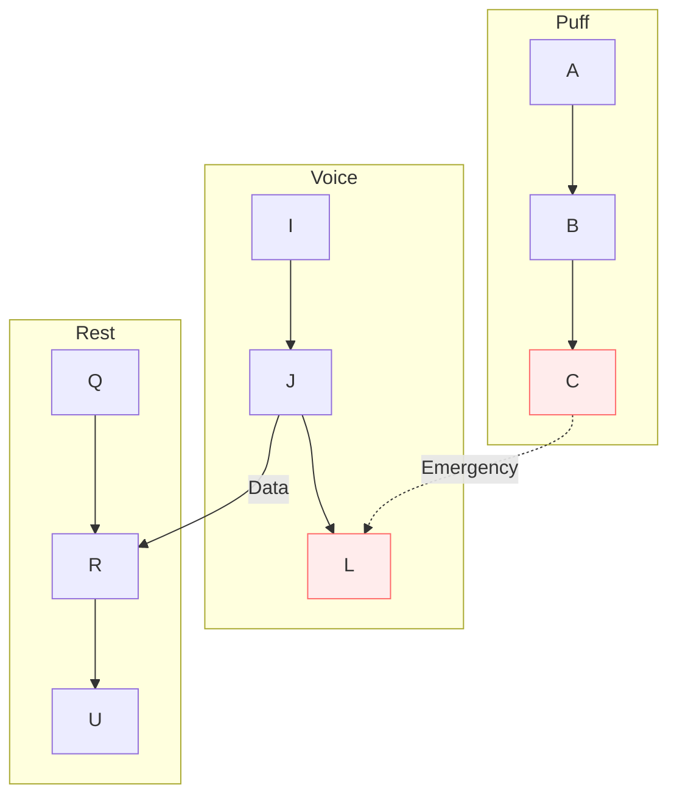
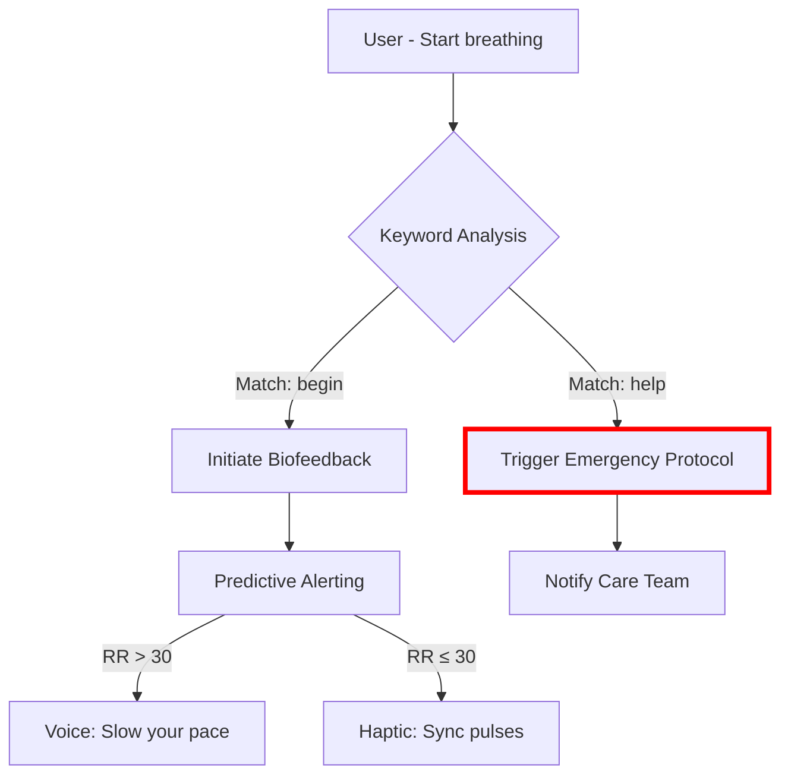
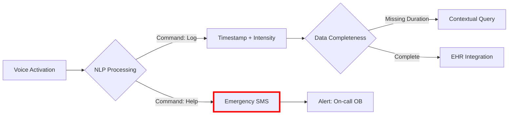
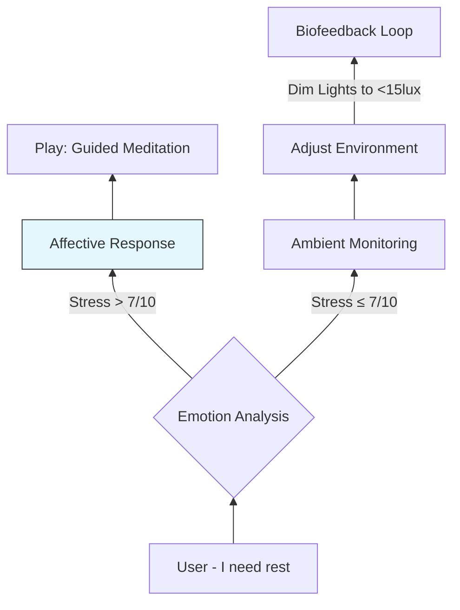

## diagram / 01 / Three interaction modes

```mermaid
graph TB
  subgraph Puff
  A --> B --> C
  end 

  subgraph Voice
  I --> J --> L
  end

  subgraph Rest
  Q --> R --> U
  end

  C -.->|Emergency| L
  J -->|Data| R
  classDef emergency fill:#ffecec,stroke:#ff6b6b;
  class C,L emergency;
```

## diagram / 02 / Puff mode

```mermaid
graph TD 
  A[User - Start breathing] --> B{Keyword Analysis}
  B -->|Match: help| C[Trigger Emergency Protocol]
  B -->|Match: begin| D[Initiate Biofeedback]
  D --> E[Predictive Alerting]
  E -->|RR > 30| F[Voice: Slow your pace]
  E -->|RR ≤ 30| G[Haptic: Sync pulses]
  C --> H[Notify Care Team]
  style C stroke:#ff0000,stroke-width:4px
```

## diagram / 03 / Voice mode

```mermaid
graph LR
  I[Voice Activation] --> J{NLP Processing}
  J -->|Command: Log| K[Timestamp + Intensity]
  J -->|Command: Help| L[Emergency SMS]
  K --> M{Data Completeness}
  M -->|Missing Duration| N[Contextual Query]
  M -->|Complete| O[EHR Integration]
  L --> P[Alert: On-call OB]
  style L stroke:#ff0000,stroke-width:4px
```

## diagram / 04 / Rest mode

```mermaid
graph BT 
  Q[User - I need rest] --> R{Emotion Analysis}
  R -->|Stress > 7/10| S[Affective Response]
  R -->|Stress ≤ 7/10| T[Ambient Monitoring]
  S --> U[Play: Guided Meditation]
  T --> V[Adjust Environment]
  V -->|Dim Lights to <15lux| W[Biofeedback Loop]
  style S fill:#e3f7fc,stroke:#333
```
